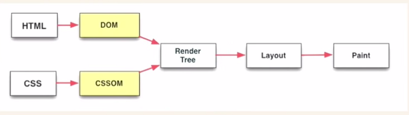
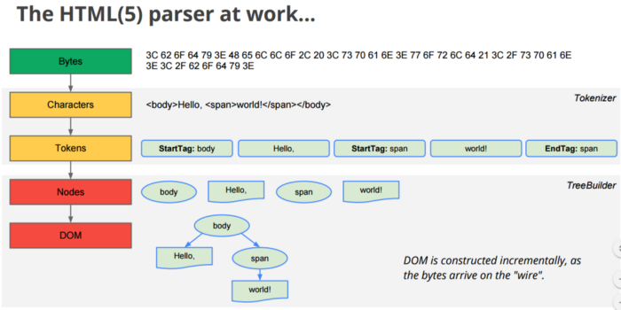
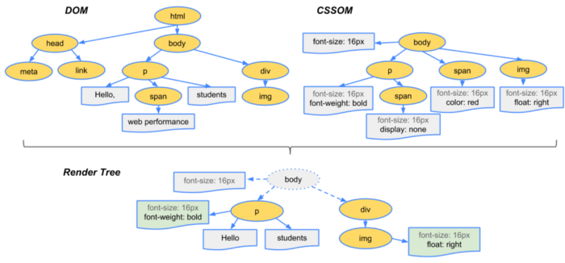
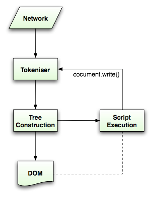

# How Does the Browser Render a Webpage?
Understand the inner workings of browsers, and the things they’ve been doing all along: DOMs, CSSOMs, render trees, layout, and paint. To create a smooth experience on the web you need to understand how the browser works. To render a page, the browser needs to follow many steps when you visit a website:
* Look up your resources.
* Create a connection between server and client.
* Incrementally download the resources.
* Parse the HTML.
* Parse CSS.
* Create DOM.
* Create CSSOM.
* Creating a render tree from DOM and CSSOM.
* Start the layout of the page and then paint.



## Download the Resources
When the TCP connection has been made between the server and the client, the data is sent incrementally in small chunks. To understand this, let's take an example:

```
<!DOCTYPE html>
<html lang="en">
  <head>
    <link rel="stylesheet" href="style.css">
    <meta
      name="description"
      content="Web site created using create-react-app"
    />
    <link rel="manifest" href="%PUBLIC_URL%/manifest.json" />

    <title>React App</title>
  </head>
  <body>
    <p>Hello <span>World!</span> </p>
  </body>
</html>
```

Suppose this is the app you are trying to make. You have a **style.css** style sheet which looks something like this:

```
p {
  font-weight: bold;
}

span {
  display: none;
}
```

You would expect this to render within nanoseconds, but if you know the internal workings of browsers, you understand the problems — and you might be the one to come up with a solution to solve those problems.

A couple of things to keep in mind:
* HTML is rendered incrementally. It’s better to stream the HTML response to the client instead of waiting for the whole page to be ready. (This is not the case in SPAs.)
* CSS is render-blocking. Get the CSS to the browser as quickly as possible.

When we start receiving the HTML, we start to parse it. This seems straightforward, but it has a lot of complexities. Suppose it comes across the following line:

```
<link rel="stylesheet" href="style.css">
```

It will stop the parsing of HTML and make a request call to fetch the file. It’ll download the file and parse the file. The same happens with <script> tags. The browser will not render the page without the CSS. If it does, it’ll show an ugly page, which you might have witnessed when the CSS fails to load.

This is the reason you put your CSS links in the head, as the page without CSS would look terrible. If your script tags are at the bottom, right above the closing body tag, they won’t interrupt the rendering of the page, and you can see something on the page to keep the user engaged.

For our example, we have downloaded the resources or we have started to stream the HTML to the browser. Let’s see what happens next.

## Parse HTML and CSS
Parsing HTML is basically tokenising every bit and piece of the HTML to make something meaningful. HTML parsers are very forgiving and tend to complete a lot of things on their own, like inserting the missing closing tags and so much more.

Before HTML5, there was no standard for constructing the DOM, so different browsers would end up with different-looking DOMs. Now everyone follows the standards. Here’s a sample of HTML parsing:



We end up with a DOM tree after this step. We still have a blank screen that is being shown to the end user.

CSS is not like HTML. It cannot be parsed incrementally because of its cascading properties. It has to be parsed once, so keep in mind the size of the CSS you’re sending with the initial load. After parsing the CSS, we have a CSSOM. Now let’s move to the next step of creating a render tree.

## Render Tree


Render tree omits all the nodes that are not required, such as **display:none, script, and meta**.

One important difference that you might have come across is between display:none and visibility: hidden. The render tree doesn’t include the node with display: none, whereas visibility:hidden is included.

This picture gives a clear example of how the DOM and CSSOM are merged together to create a render tree. This is the last step before the browser starts layouts of the nodes.

## Layout
We still haven’t painted anything on the screen as of yet. In this step, we will be calculating the sizes and positions of the nodes in the tree. It’s very good at what it does, so there is very little to explore here. We will look into this in the next sections.

## Painting
After the layout is completed, we finally start to paint the pixels on to the screen. This is where we start to see things on the browsers.

We have gone through a lot already, but we are missing the most important part of modern web applications: JavaScript. How does JS fit into the whole picture? Let’s explore further.

Whenever we encounter a <script>, the parsing is completely stopped. We fetch the file, parse the file, run JavaScript, and then continue to parse the HTML bit by bit. If we use document.write() in the script, the parsing will begin again. This can be better explained with the image below.



That is why people tend to have the script at just above the closing body tag. That way, all your parsing is already completed and document nodes are available through JavaScript.
Conclusion

Now you have an overview of how the browser works. You can now dig deeper into how you can structure your code to the best advantage and avoid all the anti-patterns.

Resources
